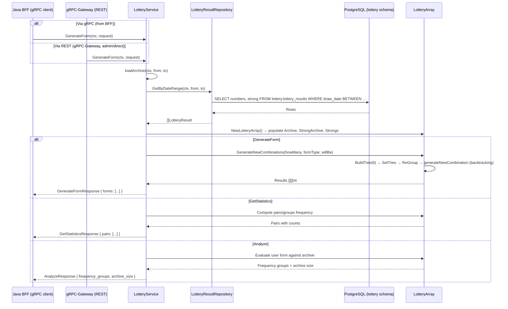
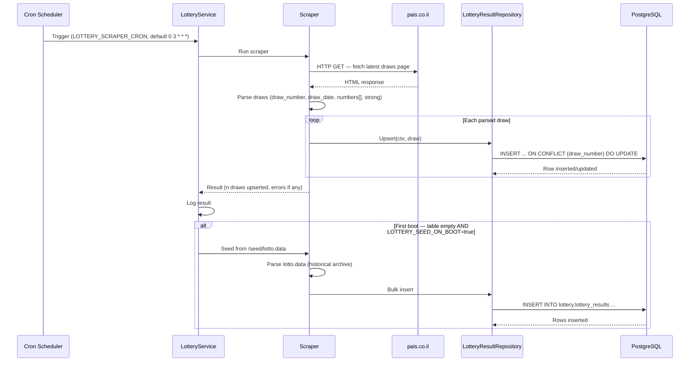
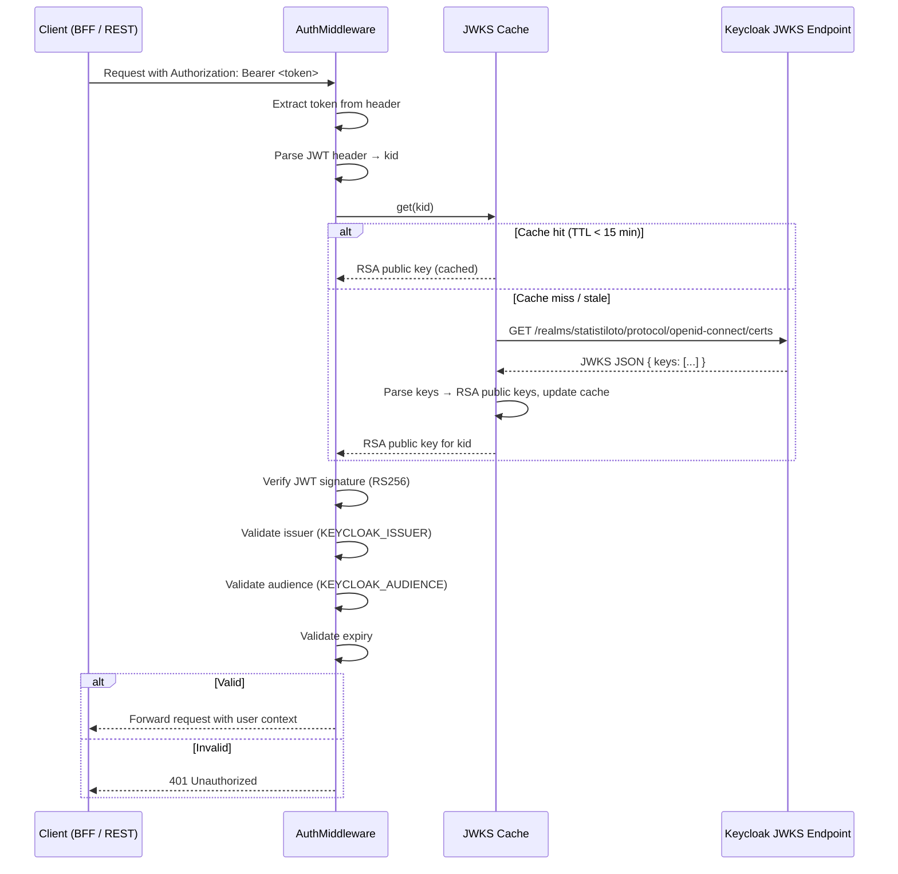
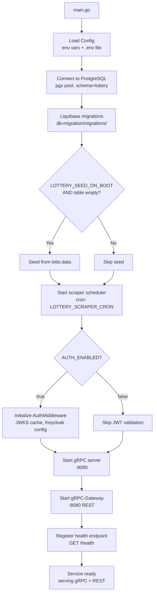

# Stat-Tree Server — Flow Documentation

Mermaid diagrams for the main flows from the Go lottery service perspective.

---

## 1. gRPC Request Flow



---

## 2. Algorithm Flow (GenerateNewCombinations)

```mermaid
flowchart TD
    START[GenerateNewCombinations<br/>cResults, formType, willBe] --> BUILD[BuildTree 6<br/>construct frequency trie]
    BUILD --> CONSIST[Consistance formType<br/>set form type constraints]
    CONSIST --> INIT[Initialize Results array<br/>cResults slots = nil]
    INIT --> LOOP{"i < cResults?"}
    LOOP -->|Yes| SETTRIES[SetTries<br/>rank numbers by frequency]
    SETTRIES --> REGROUP[ReGroup willBe<br/>front-load user's preferred numbers]
    REGROUP --> GEN[generateNewCombination<br/>recursive backtracking]
    GEN --> CHECK{"NotInResults<br/>AND AllFormsCheck?"}
    CHECK -->|Yes| CUT[CutArrayTo Tries, FormType<br/>extract combination]
    CUT --> ADD[AddResult<br/>store in Results[i]]
    ADD --> NEXT[i++]
    NEXT --> LOOP
    CHECK -->|No| RECURSE[Try next position<br/>swap, recurse]
    RECURSE --> GEN
    RECURSE -->|Exhausted| FALLBACK[Return nil — no valid combo found]
    FALLBACK --> NEXT
    LOOP -->|No| DONE[Return Results<br/>[][]int of cResults combinations]
```

---

## 3. Scraper Flow



---

## 4. Auth Validation Flow



---

## 5. Startup Flow


