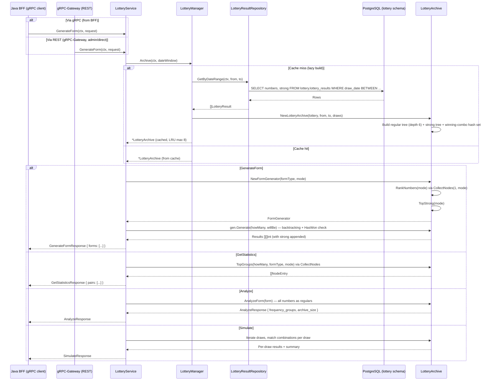
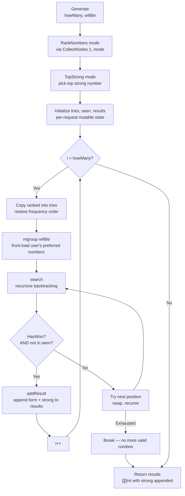
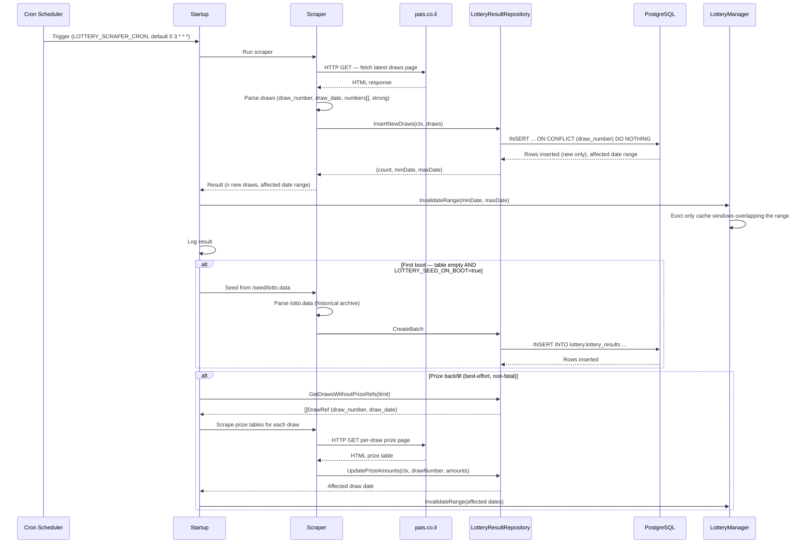
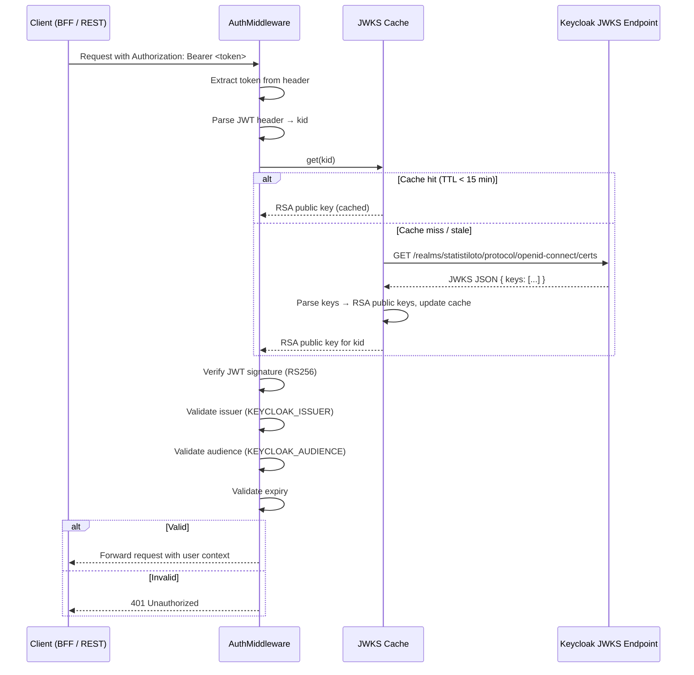
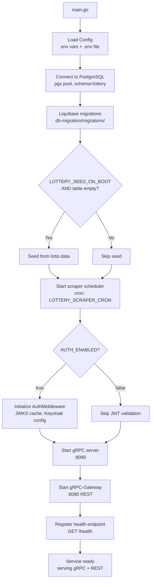
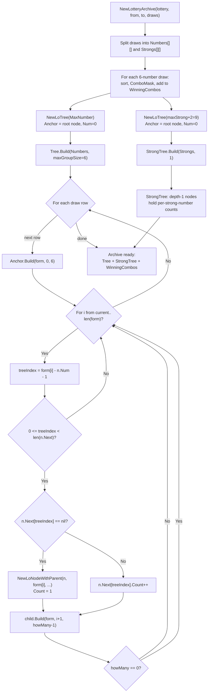
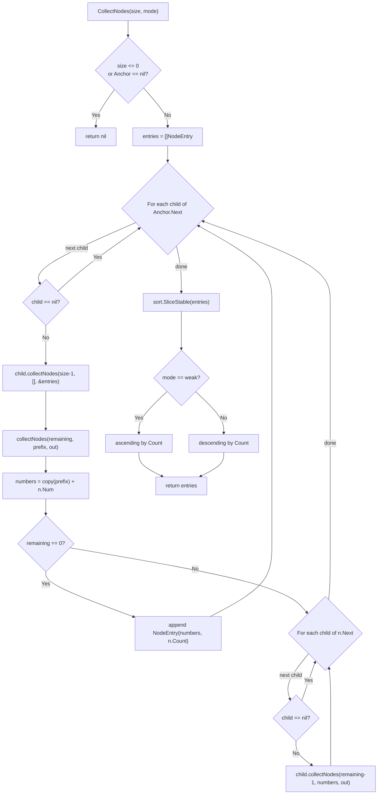
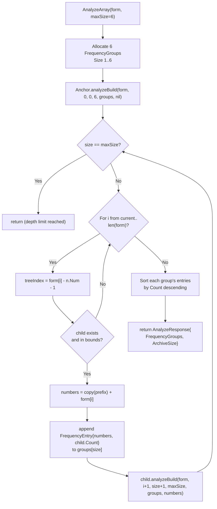
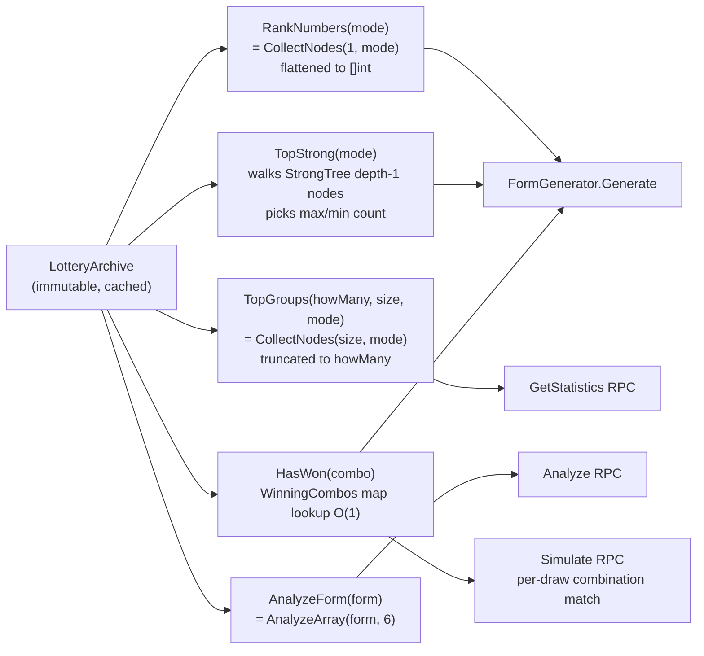

# Stat-Tree Server — Flow Documentation

Mermaid diagrams for the main flows from the Go lottery service perspective.

---

## 1. gRPC Request Flow

---

## 2. Algorithm Flow (FormGenerator.Generate)

---

## 3. Scraper Flow

---

## 4. Auth Validation Flow

---

## 5. Startup Flow

---

## 6. Tree Algorithm Flow

The `LotteryArchive` owns two immutable prefix trees built once per date
window: a regular-number tree (depth `maxGroupSize = 6`) and a strong-number
tree (depth 1). Every statistics, analyze, and generation query reads from
these trees without mutating them.

> **Historical format note:** The default archive start date is `2004-02-12`,
> when the current Lotto format began (regular numbers 1–37, strong 1–7).
> Draws before that date used the old 6/49 format (regular numbers up to 49,
> no separate strong number) and are not comparable. The UI shows a disclaimer
> when the user selects a pre-2004 start date. See
> [`internal/lottery-tree/README.md`](../internal/lottery-tree/README.md#historical-format--archive-default)
> for the full format-era breakdown and strong-tree sizing rationale.

### 6.1 Build — `NewLotteryArchive` → `LoTree.Build` → `LoNode.Build`

### 6.2 Query — `CollectNodes(size, mode)`

A single read-only walk that materialises every group of the requested size
together with its occurrence count, then sorts once. Replaces the former
`BestPares`, which re-traversed per group and mutated tree state.

### 6.3 Analyze — `AnalyzeArray` → `analyzeBuild`

Walks only the paths that match the user-submitted form, appending one
`FrequencyEntry` per visited node directly into the matching `FrequencyGroup`.
All submitted values are treated as regular numbers; nothing is stripped.

### 6.4 Read APIs that reuse the tree

